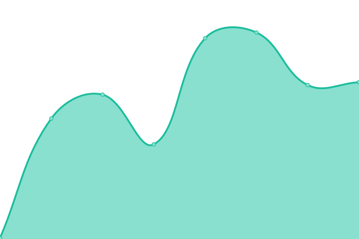
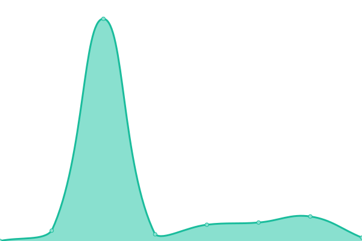

# [📈 Live Status](https://November-Games.github.io/upptime): <!--live status--> **🟩 All systems operational**

This repository contains the open-source uptime monitor and status page for [November-Games](https://November-Games.github.io/upptime), powered by [Upptime](https://github.com/upptime/upptime).

With [Upptime](https://upptime.js.org), you can get your own unlimited and free uptime monitor and status page, powered entirely by a GitHub repository. We use [Issues](https://github.com/November-Games/upptime/issues) as incident reports, [Actions](https://github.com/November-Games/upptime/actions) as uptime monitors, and [Pages](https://November-Games.github.io/upptime) for the status page.

<!--start: status pages-->
<!-- This summary is generated by Upptime (https://github.com/upptime/upptime) -->
<!-- Do not edit this manually, your changes will be overwritten -->
<!-- prettier-ignore -->
| URL | Status | History | Response Time | Uptime |
| --- | ------ | ------- | ------------- | ------ |
|  [novembergames.com](https://novembergames.com) | 🟩 Up | [novembergames-com.yml](https://github.com/November-Games/upptime/commits/HEAD/history/novembergames-com.yml) | 

 154ms
     
 | 

<a href="https://November-Games.github.io/upptime/history/novembergames-com">100.00%</a>
    

|  [steamcore.com](https://steamcore.com) | 🟩 Up | [steamcore-com.yml](https://github.com/November-Games/upptime/commits/HEAD/history/steamcore-com.yml) | 

 167ms
     
 | 

<a href="https://November-Games.github.io/upptime/history/steamcore-com">100.00%</a>
    

|  [beta.steamcore.com](https://beta.steamcore.com) | 🟩 Up | [beta-steamcore-com.yml](https://github.com/November-Games/upptime/commits/HEAD/history/beta-steamcore-com.yml) | 

 165ms
     
 | 

<a href="https://November-Games.github.io/upptime/history/beta-steamcore-com">100.00%</a>
    

|  [api.novembergames.com](https://api.novembergames.com) | 🟩 Up | [api-novembergames-com.yml](https://github.com/November-Games/upptime/commits/HEAD/history/api-novembergames-com.yml) | 

 157ms
     
 | 

<a href="https://November-Games.github.io/upptime/history/api-novembergames-com">100.00%</a>
    

<!--end: status pages-->

[**Visit our status website →**](https://November-Games.github.io/upptime)

## 📄 License

- Powered by: [Upptime](https://github.com/upptime/upptime)
- Code: [MIT](./LICENSE) © [November-Games](https://November-Games.github.io/upptime)
- Data in the `./history` directory: [Open Database License](https://opendatacommons.org/licenses/odbl/1-0/)
